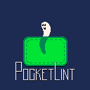

## PocketLint


### Current 'some sort of plan' (slightly outdated)

### Framework Design for PocketLint
`PocketLint` is a *PICO-8*-inspired 2D game engine built with OpenTK 4.9.4 and .NET 8 (AOT-compiled to native code), using an indexed-color rendering system (128x128 index texture, 512x512 window, 16-color palette with index 0 transparent). It uses an Entity-Component-System (ECS) architecture, C# scripting, and a builder that produces a native executable with embedded assets. The design hides OpenGL, byte arrays, and engine details, letting you focus on game logic via entities and components.

#### 1. User Experience
- **Scripting**:
  - Users write C# scripts deriving from `GameScript`, overriding `Init()` and `Update(float dt)`. No `Draw()` callback—rendering is handled by `SpriteRenderer` components.
  - Example:
    ```csharp
    public class MyGame : GameScript
    {
        public override void Update()
        {
            if (IsKeyDown(Key.Right)) Transform.SetWorldPosition(Transform.WorldX + 50 * Time.DeltaTime, Transform.WorldY);
            PlaySound(0); // Footstep
        }
    }
    ```
  - API focuses on entities, components, input, and audio. No OpenGL or byte arrays exposed.

- **Assets**:
  - **Sprites**: Created in an external editor, saved as `.plspr` (binary sprite indices).
  - **Audio**: WAV or MP3 files, played via `PlaySound(id)`. Perhaps even `.plaud` for chiptune-like sounds
  - **Scripts**: C# files, compiled to native code at build time.

- **API**:
  - **Entities**: `CreateEntity(name)`, `GetEntity(name)`, `AddComponent<T>`, `GetComponent<T>`.
  - **Components**: `Transform.LocalX`, `SpriteRenderer.SpriteIndex`, `Animator.Sequence`.
  - **Input**: `IsKeyDown(key)`, `GetMousePosition()`.
  - **Audio**: `PlaySound(id)`, `StopSound(id)`.
  - **Palette**: `SetColor(index, r, g, b)`, `RemapColor(fromIndex, toIndex)` (for palette swaps).
  - **Debug (internal)**: `FrameBuffer.Clear(colorIndex)`, `FrameBuffer.DrawRect(x, y, w, h, colorIndex)`—not exposed to scripts.

#### 2. Architecture
- **Game**:
  - Entry point, initializes OpenTK window (512x512, 60 FPS), systems, and managers via the loader.
  - Loads user script (`MyGame`), calls `Init()`, `Update(dt)`.
  - Coordinates systems via `Scene`.

- **EntityManager**:
  - Stores entities (ID, name, components).
  - Queries components (e.g., all entities with `SpriteRenderer`).
  - Example (mainly accessed via Scene): `Scene.AddComponent<SpriteRenderer>(entityId)`.

- **Components**:
  - **Transform**: `(X, Y, Rotation, Scale)`—positions sprites.
  - **SpriteRenderer**: `(SpriteIndex, Layer, FlipX, FlipY)`—defines sprite to render.
  - **Animator**: `(CurrentFrame, Sequence, Speed, PaletteRemap)`—controls animations.
  - **InputComponent** (future): `(KeyBindings, Actions)`—for player control.
  - **LineRenderer/BoxRenderer** (future): `(Points/ColorIndex)`—for custom debug shapes.
  - Extensible for `PhysicsComponent`, etc.

- **Systems**:
  - **RenderingSystem**:
    - Reads `Transform` and `SpriteRenderer` components.
    - Draws sprites to `FrameBuffer` using `SpriteSheet` indices.
    - Updates OpenGL textures via `TextureManager`, renders quad with `ShaderLoader`.
  - **AnimationSystem**:
    - Updates `Animator` components, sets `SpriteRenderer.SpriteIndex`.
  - **InputSystem**:
    - Processes OpenTK input, updates `InputComponent`.
  - **AudioSystem** (future):
    - Plays sounds via OpenAL.

- **Managers**:
  - **FrameBuffer**:
    - Manages 128x128 index buffer (hidden byte array).
    - Debug methods: `Clear`, `DrawRect`, `DrawSprite` (used by `RenderingSystem` or tests).
    - Provides pixel data to `RenderingSystem`.
  - **SpriteSheet**:
    - Stores `byte[256, 64]` for 256 8x8 sprites.
    - Loads `.plspr` files via `AssetManager`.
  - **Palette**:
    - Manages 16 RGBA colors (index 0 transparent).
    - Supports remapping, updates `TextureManager`.
  - **TextureManager**:
    - Handles OpenGL textures (index: 128x128, palette: 16x1).
  - **ShaderLoader**:
    - Loads vertex/fragment shaders.
  - **AssetManager**:
    - Loads `.plspr`, `.wav`/`.mp3`, compiles `.cs` scripts.
  - **SoundManager** (future):
    - Manages audio playback.

- **GameLoop**:
  - **Update**: Calls `GameScript.Update()`, runs `InputSystem`, `AnimationSystem`.
  - **Render**: `RenderingSystem` processes `SpriteRenderer` components, draws via `FrameBuffer`.

#### 3. Builder and Loader
- **PocketLint Builder**:
  - Tool: `plbuild` (command-line or future GUI).
  - **Input**:
    - `*.cs`: Game scripts.
    - `*.plspr`: Sprite sheets.
    - `*.plaud`: Audio files.
    - `Config/game.plconfig`: Settings (title, start scene, etc).
  - **Process**:
    - Compiles C# scripts to native code using NativeAOT or IL2CPP.
    - Converts sprites to `SpriteSheet` binary format.
    - Embeds assets and scripts in `.data` section of a PE executable.
    - Generates loader (C++ or AOT-compiled C#) to initialize OpenTK and run game.
  - **Output**: Single executable (`MyGame.exe`) with no .NET runtime dependency.

- **Loader**:
  - A minimal PE executable (C++ or AOT C#).
  - **Functions**:
    - Initializes OpenTK window, OpenGL context.
    - Extracts assets/scripts from `.data` section (binary blobs).
    - Loads `GameScript`, sets up `EntityManager`, systems, and managers.
    - Runs game loop.
  - **Structure**:
    - embedded assets, generated code, etc.
    - Loader code: OpenTK boilerplate, asset extraction, game startup.
  - **Size**: Optimized for minimal footprint (like *PICO-8*’s tiny runtime).

- **Packaging**:
  - `.plgame`: Embedded binary containing all game data.
  - Executable: Loader + `.plgame`, runs natively on Windows/macOS/Linux.

#### 4. Tooling
- **Asset Editor** (future):
  - Sprite editor for 8x8 sprites, saves `.plspr`.
  - Palette editor for 16 colors.
  - Audio editor for chiptunes, importer for WAV/MP3.
- **Project Template**:
  - Folders: `Config`, `Manifest`.
  - Sample `MyGame.cs` with player entity and animation.

#### 5. Final Picture
- **Game Development**:
  - Create project: `MyGame/`.
  - Write `MyGame.cs`:
    ```csharp
    public class MyGame : GameScript
    {
        private Entity player;
        public override void Init()
        {
        }
        public override void Update()
        {
            if (IsKeyDown(Key.Right)) Transform.SetWorldPosition(Transform.WorldX + 50 * Time.DeltaTime, Transform.WorldY);
            PlaySound(0); // Footstep
        }
    }
    ```
  - Draw sprites in external editor, save `player.plspr`.
  - Add `footstep.wav` to `Assets/Audio`.
  - Set `game.plconfig` (title: “My Game”).

- **Build**:
  - Run `plbuild --game MyGame/MyGame.csproj --output MyGame.exe`.
  - Get `MyGame.exe` (native, no .NET runtime).
  - Run: 512x512 window, player sprite animates, moves right, plays sound.

- **Hidden Details**:
  - OpenGL, byte arrays: Managed by `RenderingSystem`, `FrameBuffer`, `TextureManager`.
  - Sprite indices: Handled by `SpriteSheet`.
  - Rendering: Driven by `SpriteRenderer` components, no manual draw calls.

#### 6. Comparison to PICO-8
- **Similarities**:
  - Simple API (entity-based vs. `spr`).
  - Indexed rendering (16 colors, transparent 0).
  - Sprite sheet (256 8x8 sprites).
  - Standalone executable.
- **Differences**:
  - *PICO-8*: Lua, 30 FPS, built-in editor.
  - `PocketLint`: C#, 60 FPS, ECS, external editor (for now).
  - `PocketLint`: Native AOT, no runtime; *PICO-8*: Lua VM.

#### 7. Implementation Phases
- **Phase 1 (Current)**:
  - `FrameBuffer`, `Palette`, `SpriteSheet`, `TextureManager`, `ShaderLoader`.
  - Debug rendering: Grid, sprite, `DrawRect`.
- **Phase 2**:
  - Refactor: Move pixel buffer to `FrameBuffer`, slim `Renderer` to OpenGL.
  - Add `EntityManager`, `Transform`, `SpriteRenderer`, `Animator`.
  - Build `RenderingSystem`, `AnimationSystem`, `GameScript`.
- **Phase 3**:
  - Add `InputSystem`, `AssetManager`, `SoundManager`.
  - Support `.plspr`, `.wav` loading.
- **Phase 4**:
  - Build `plbuild`, loader, and `.data` embedding.
  - Implement NativeAOT compilation.
- **Phase 5 (Stretch)**:
  - WebAssembly via Mono.Wasm.
  - Asset editor.

#### 8. Architecture Diagram
```
Game (Loader)
├── GameScript (Init, Update)
├── EntityManager
│   ├── Entity (ID, Name, Components)
│   │   ├── Transform (X, Y, Rotation, Scale)
│   │   ├── SpriteRenderer (SpriteIndex, Layer)
│   │   ├── Animator (Frame, Sequence, Speed)
│   │   └── (Future: InputComponent, LineRenderer)
├── Systems
│   ├── RenderingSystem (FrameBuffer, TextureManager, ShaderLoader, Palette)
│   ├── AnimationSystem
│   ├── InputSystem
│   └── AudioSystem (future)
├── Managers
│   ├── FrameBuffer (128x128 index buffer, debug DrawRect)
│   ├── SpriteSheet (256 8x8 sprites)
│   ├── Palette (16 colors, transparent 0)
│   ├── TextureManager (OpenGL textures)
│   ├── ShaderLoader (shaders)
│   ├── AssetManager (sprites, audio, scripts)
│   └── SoundManager (future)
└── OpenTK Window (512x512, 60 FPS)
```

### Builder Build
```bash
dotnet clean
dotnet restore
dotnet build
dotnet run --project PocketLint.Builder.csproj build --game ../MyDemoGame/MyDemoGame.csproj --output MyDemoGame.exe
```
Will become clean CLI later

### TODO
#### Current focus
*  **Scene setup**
    * [ ] Load palette from `.plscene`
    * [x] Load spritesheet from `.plscene`
---
#### Backlog
* [x] Render Layers, eg. Background (tiles), Active, UI, More(?)
* [x] Build game into standalone, native executable
* [ ] UI
* [ ] Animation
* [ ] Gravity
* [ ] Create new game project with boilerplate and required stuff
```bash
plbuild new --name MyNewGame
```
* [ ] Design-time runner project
* [ ] Clean up the generators
* [ ] Spritesheet packing (`.plspr`)
* [ ] Prefabs (`.plfab`)
* [ ] Scriptable Objects (`.plobj`)
* [ ] Editor
* [ ] Chip-tune audio